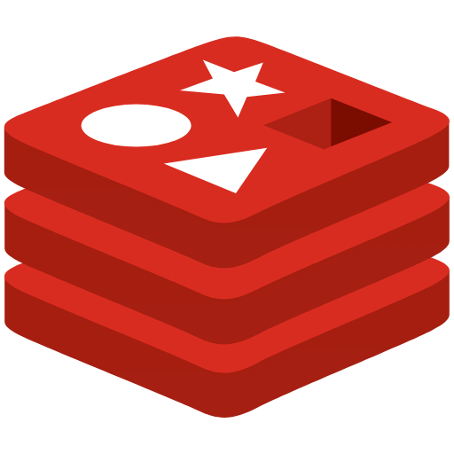

### Hi there 👋

<!--
**ellisjoe611/ellisjoe611** is a ✨ _special_ ✨ repository because its `README.md` (this file) appears on your GitHub profile.

Here are some ideas to get you started:

- 🔭 I’m currently working on ...
- 🌱 I’m currently learning ...
- 👯 I’m looking to collaborate on ...
- 🤔 I’m looking for help with ...
- 💬 Ask me about ...
- 📫 How to reach me: ...
- 😄 Pronouns: ...
- ⚡ Fun fact: ...
-->

Developer who enjoys coffee in the morning ☕, deep-dives into logics during daytime 🔥, and prepares better tomorrow at night 🌙

Started as Web Developer, currently working as **Backend Developer** for better APIs & streaming ⚡️ 

## Main Topics 👀

- Backend with lower latency ⏳ with optimization & caching
- Latest updates of Python 🐍
- Background tasks ⏱️ with Celery
- AI-Agents 🤖

## Specs

**[Languages]**
 

 

**[Frameworks & Libraries]**
 

 

**[Databases]**
 

 

**[CI/CD]**
 

 
